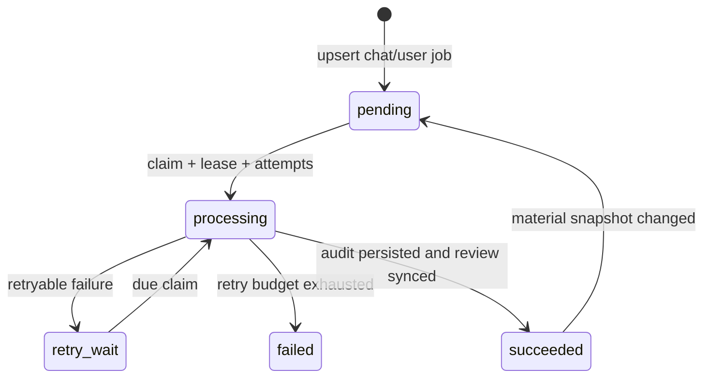

# Единый lifecycle аудита нового пользователя

## Цель

Проверка нового пользователя — один доменный процесс на пару `(chat_id, telegram_user_id)`:

1. refresh профиля;
2. сбор bounded snapshot профиля, поведения, первого сообщения и аватара;
3. единый audit/score;
4. создание review request;
5. отдельная Telegram delivery только при `risk_score >= 70`.

`avatar_analysis_jobs` и `first_message_spam_analysis_jobs` не должны независимо менять risk score, создавать review или отправлять Telegram-карточки.

## Текущая проблема

Сейчас `user_profiles::enrichment::process_refreshed_profile` синхронно сохраняет baseline audit, отдельно ставит first-message и avatar jobs, а каждый из трёх путей может вызывать `create_review` и `send_review`.

Это создаёт три независимых lifecycle, несколько LLM requests и гонку score: повторный baseline upsert способен затереть ранее применённые async contributions.

## Целевая state machine



Внутри `processing` stages выполняются в одном orchestration worker:

```text
baseline profile/behavior
  -> first-message evidence, если доступно и включено
  -> avatar evidence, если доступно и включено
  -> transaction: materialize final score/signals and upsert review request
```

Telegram transport не является stage audit worker-а. Единственный review delivery worker отдельно claim-ит `spam_review_requests`; DB constraint и `send_review` не допускают delivery ниже 70.

## Score ownership

Risk score нельзя дальше хранить как смесь полного baseline upsert и async `risk_score = risk_score + delta`.

Authoritative итог строится из idempotent contributions:

```text
final_score = clamp(baseline_score + first_message_delta + avatar_delta, 0, 100)
```

Каждый contribution хранит input/snapshot version и применяется один раз. Повторный profile refresh пересчитывает baseline, но не затирает действующие contributions.

## Rollout без потери jobs

1. Добавить additive `new_user_audit_jobs` с `chat_id`, `telegram_user_id`, state, attempts, lease, snapshot hash и typed stage states.
2. Добавить worker и integration tests, но оставить его в shadow mode: он не меняет authoritative score и не создаёт review.
3. Перенести pending/retry legacy first-message jobs в новую per-chat очередь; старые rows отметить `migrated`, чтобы исключить dual claim.
4. Для avatar jobs создать per-chat jobs только для существующих audit rows; global image cache по `profile_photo_file_unique_id + prompt_version` остаётся reusable. Legacy avatar jobs без chat audit остаются в legacy drain.
5. После сверки score/results переключить producer после profile refresh на один unified enqueue.
6. Только затем убрать старые workers и старые call sites отдельным change.

Legacy `processing` rows не reclaim-ятся новым worker-ом до истечения старой lease или controlled drain.

## Обязательные гарантии

- один claim owner: `FOR UPDATE SKIP LOCKED`, lease и CAS по `(id, attempts, status)`;
- bounded retry: `15s → 30s → 60s → 5m → 24h → terminal failed`;
- missing/unavailable avatar — нейтральный evidence state, не бесконечный retry;
- first message/avatar disabled — stage `not_required`, без backlog/external request;
- один review request на `(chat_id, user)`;
- no Telegram send из unified audit worker;
- score `69` никогда не имеет delivery attempt/message id; score `70` становится claimable;
- stale worker не меняет score, signals или review.

## Acceptance tests

PostgreSQL integration tests должны покрыть:

- dedup и scope по `(chat_id, user)`;
- lease reclaim/CAS stale finalizer;
- migration pending/retry/expired-processing rows без dual claim;
- idempotent contributions и сохранение их при refresh baseline;
- avatar change rejects stale snapshot;
- disabled stages не создают job/backlog;
- retry exhaustion;
- review threshold и отсутствие Telegram send ниже 70;
- два concurrent stage completion создают один review request.
