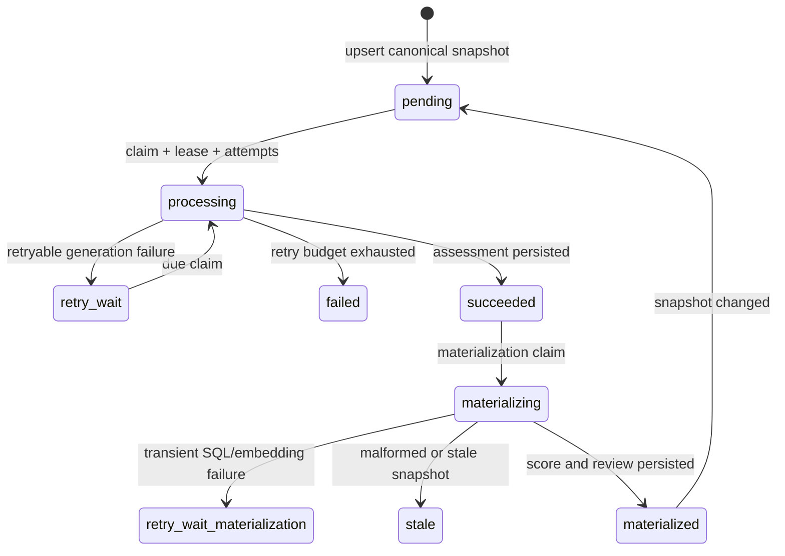

# Единый lifecycle аудита нового пользователя

Проверка нового пользователя — один доменный процесс на пару
`(chat_id, telegram_user_id)`:

1. refresh профиля;
2. bounded snapshot профиля, поведения, первого сообщения и аватара;
3. один LLM audit на route `new_user_audit`;
4. атомарная materialization score/signals и review request;
5. отдельная bounded Telegram delivery только при `risk_score >= 70`.

Avatar и first-message являются секциями единого assessment. Отдельных
очередей, LLM routes и workers для них нет. Старые таблицы и миграции остаются
в БД для backward compatibility, но runtime их больше не enqueue-ит и не
обрабатывает.

## State machine



Generation and materialization have independent leases. A successful LLM
response is persisted before materialization starts, so SQL or embedding
failures never reopen LLM generation. A stale snapshot cannot overwrite a
newer baseline.

## Score ownership

The final score is rebuilt from idempotent components:

```text
final_score = clamp(baseline_score + first_message_delta + avatar_delta, 0, 100)
```

The materializer writes the audit row and upserts one review request in the
same transaction. Telegram delivery is a separate worker and never changes the
score.

## Guarantees

- one claim owner: `FOR UPDATE SKIP LOCKED`, lease and CAS;
- bounded generation and materialization retries with terminal states;
- missing avatar is a valid text-only assessment, not an endless retry;
- one audit job and one review request per canonical snapshot/user;
- score `69` has no delivery attempt, score `70` is claimable;
- stale workers cannot change score, signals or review state.

Historical migration files and tables are intentionally not dropped: they may
already be applied to production databases. They are no longer part of the
application flow or reviewed MCP catalog.
